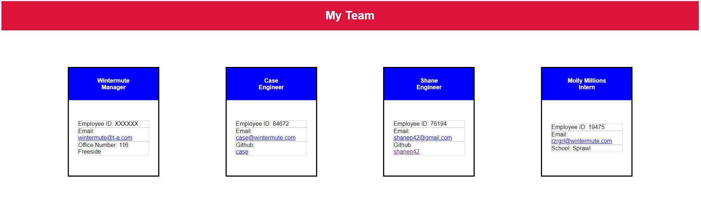

# Team Profile Generator 

## Description 
This application is intended to create and display team profile information in a generated HTML page, created from user input using the Inquirer module from Node.js.
 
## Table of Contents
* [Installation](#installation)
* [Usage](#usage)
* [Contributing](#contributing)
* [Tests](#tests)
* [Questions](#questions)

## Installation
This application requires Node, the fs and inquirer modules, as well as Jest if you would like to perform testing from the tests directory.

## Usage 
Use inquirer from your command line to answer questions about your project.
Video demo here - [Screencastify](https://watch.screencastify.com/v/ItXNTxYfcn9WL3cDm4qH) 

## Tests
Run `npm test` to run Jest for tests on the various employee class constructors. 

## Questions
Github Username: shanep42
Email: shanep42@gmail.com
